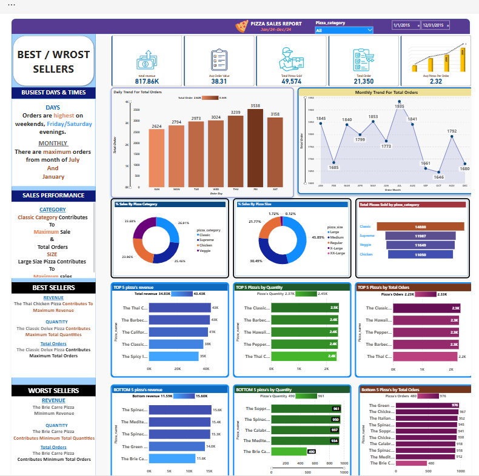

# Pizza Sales Analysis
## 📌 Problem Statement & Chart Requirements




## Business Problem
A pizza restaurant wants to analyze its sales data to understand revenue drivers, customer ordering patterns, and product performance in order to improve business decisions.

## Objectives
- Measure overall sales and revenue performance
- Identify high-performing and low-performing pizzas
- Analyze order trends across days and months
- Understand customer purchasing behavior

## Dataset Overview
The dataset contains transactional pizza sales data with:
- Order ID & Order Date
- Pizza Name, Category, and Size
- Quantity Sold
- Total Price

The dataset represents historical pizza sales transactions from a restaurant.

## Tools Used
- SQL (Data aggregation and analysis)
- Power BI / Excel (for visualization – optional)

## Analysis Summary
The analysis focuses on:
- Key business KPIs (Revenue, Orders, AOV)
- Time-based trends (Daily & Monthly)
- Revenue contribution by pizza category and size
- Top and bottom performing products

## Key Insights
- A small number of pizzas contribute a significant portion of total revenue
- Certain pizza categories consistently outperform others
- Weekends generate higher order volumes compared to weekdays
- Some pizzas show low demand but still occupy menu space

## Business Recommendations
- Focus marketing and promotions on top-performing pizzas
- Optimize inventory for high-demand categories
- Re-evaluate or redesign low-performing pizzas
- Align staffing and operations with peak demand days

## Key Results
- Overall revenue and order-level KPIs were successfully calculated using SQL
- Average order value and average pizzas per order highlight customer purchasing behavior
- Weekend demand is higher compared to weekdays
- Top 5 pizzas contribute a major share of total revenue

## SQL Queries & Analysis
The following SQL queries were used to derive business insights from the pizza sales dataset.

```sql
-- =========================================================
-- Pizza Sales Analysis | SQL Queries
-- =========================================================

-- A. Key Performance Indicators (KPIs)

-- 1. Total Revenue
SELECT 
    SUM(total_price) AS total_revenue
FROM pizza_sales;

-- 2. Average Order Value (AOV)
SELECT 
    SUM(total_price) / COUNT(DISTINCT order_id) AS avg_order_value
FROM pizza_sales;

-- 3. Total Pizzas Sold
SELECT 
    SUM(CAST(quantity AS INT)) AS total_pizzas_sold
FROM pizza_sales;

-- 4. Total Orders
SELECT 
    COUNT(DISTINCT order_id) AS total_orders
FROM pizza_sales;

-- 5. Average Pizzas per Order
SELECT 
    CAST(
        SUM(CAST(quantity AS INT)) * 1.0 / COUNT(DISTINCT order_id)
        AS DECIMAL(10,2)
    ) AS avg_pizzas_per_order
FROM pizza_sales;

-- B. Daily Trend of Orders
SELECT 
    DATENAME(WEEKDAY, order_date) AS order_day,
    COUNT(DISTINCT order_id) AS total_orders
FROM pizza_sales
GROUP BY 
    DATEPART(WEEKDAY, order_date),
    DATENAME(WEEKDAY, order_date)
ORDER BY 
    DATEPART(WEEKDAY, order_date);

-- C. Monthly Trend of Orders
SELECT 
    DATENAME(MONTH, order_date) AS month_name,
    COUNT(DISTINCT order_id) AS total_orders
FROM pizza_sales
GROUP BY 
    DATENAME(MONTH, order_date),
    MONTH(order_date)
ORDER BY 
    MONTH(order_date);

-- D. Revenue Contribution by Pizza Category (%)
SELECT 
    pizza_category,
    CAST(SUM(total_price) AS DECIMAL(10,2)) AS total_revenue,
    CAST(
        SUM(total_price) * 100.0 / 
        (SELECT SUM(total_price) FROM pizza_sales)
        AS DECIMAL(10,2)
    ) AS revenue_percentage
FROM pizza_sales
GROUP BY pizza_category;

-- E. Revenue Contribution by Pizza Size (%)
SELECT 
    pizza_size,
    CAST(SUM(total_price) AS DECIMAL(10,2)) AS total_revenue,
    CAST(
        SUM(total_price) * 100.0 / 
        (SELECT SUM(total_price) FROM pizza_sales)
        AS DECIMAL(10,2)
    ) AS revenue_percentage
FROM pizza_sales
GROUP BY pizza_size
ORDER BY pizza_size;

-- F. Total Pizzas Sold by Category
SELECT 
    pizza_category,
    SUM(CAST(quantity AS INT)) AS total_quantity_sold
FROM pizza_sales
GROUP BY pizza_category
ORDER BY total_quantity_sold DESC;

-- G. Top 5 Pizzas by Revenue
SELECT TOP 5
    pizza_name,
    SUM(total_price) AS total_revenue
FROM pizza_sales
GROUP BY pizza_name
ORDER BY total_revenue DESC;

-- H. Bottom 5 Pizzas by Revenue
SELECT TOP 5
    pizza_name,
    SUM(total_price) AS total_revenue
FROM pizza_sales
GROUP BY pizza_name
ORDER BY total_revenue ASC;

-- I. Top 5 Pizzas by Quantity Sold
SELECT TOP 5
    pizza_name,
    SUM(CAST(quantity AS INT)) AS total_pizzas_sold
FROM pizza_sales
GROUP BY pizza_name
ORDER BY total_pizzas_sold DESC;

-- J. Bottom 5 Pizzas by Quantity Sold
SELECT TOP 5
    pizza_name,
    SUM(CAST(quantity AS INT)) AS total_pizzas_sold
FROM pizza_sales
GROUP BY pizza_name
ORDER BY total_pizzas_sold ASC;

-- K. Top 5 Pizzas by Total Orders
SELECT TOP 5
    pizza_name,
    COUNT(DISTINCT order_id) AS total_orders
FROM pizza_sales
GROUP BY pizza_name
ORDER BY total_orders DESC;

-- L. Bottom 5 Pizzas by Total Orders
SELECT TOP 5
    pizza_name,
    COUNT(DISTINCT order_id) AS total_orders
FROM pizza_sales
GROUP BY pizza_name
ORDER BY total_orders ASC;

-- M. Bottom 5 Classic Pizzas by Total Orders
SELECT TOP 5
    pizza_name,
    COUNT(DISTINCT order_id) AS total_orders
FROM pizza_sales
WHERE pizza_category = 'Classic'
GROUP BY pizza_name
ORDER BY total_orders ASC;

```
## Conclusion
This project demonstrates how SQL can be used to transform raw transactional sales data into actionable business insights that support data-driven decision-making.
