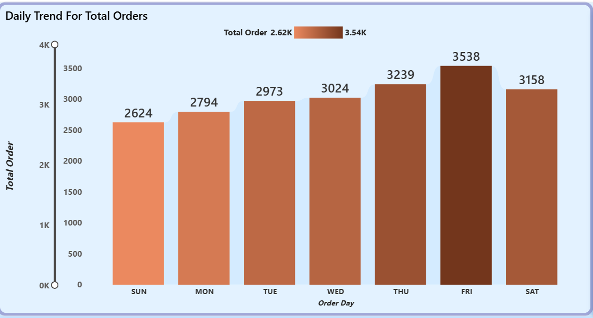
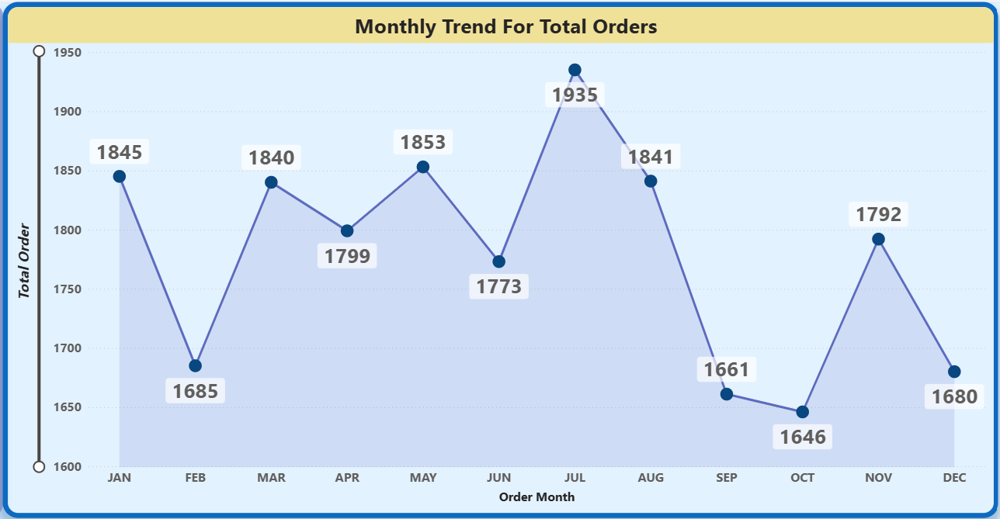
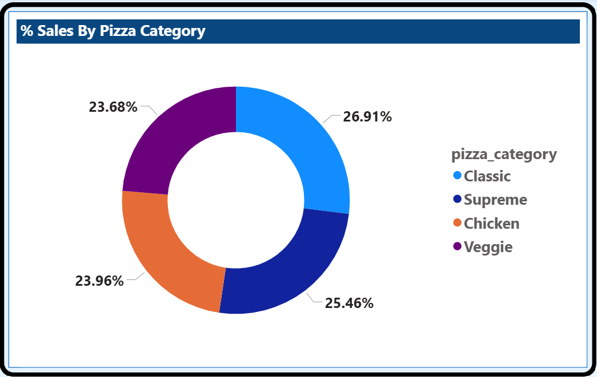
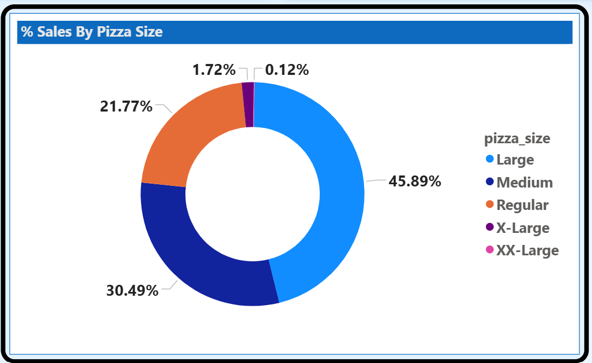
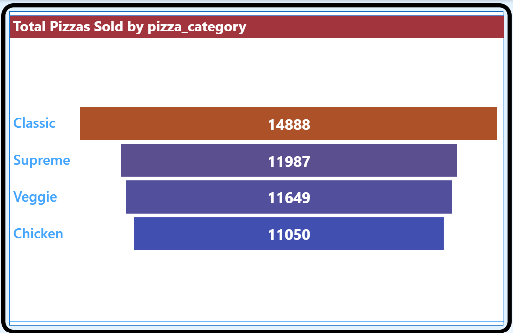
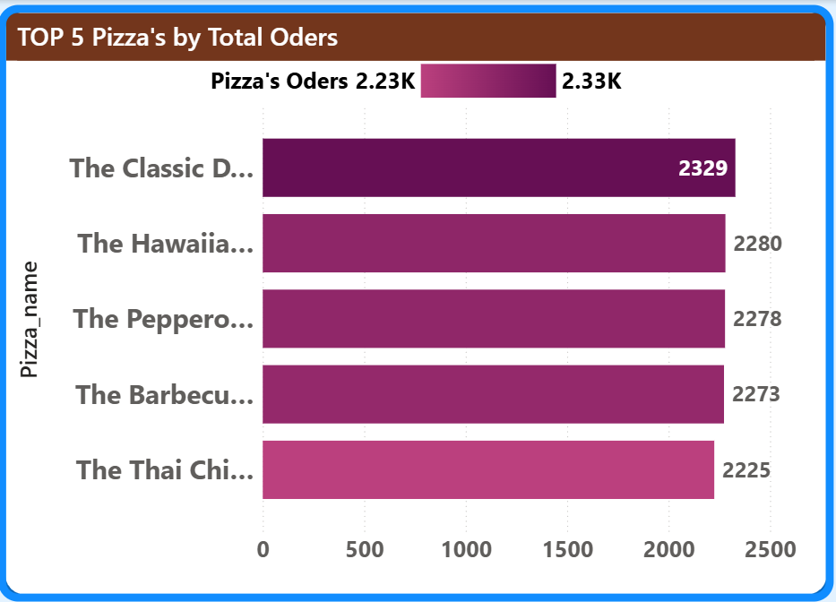
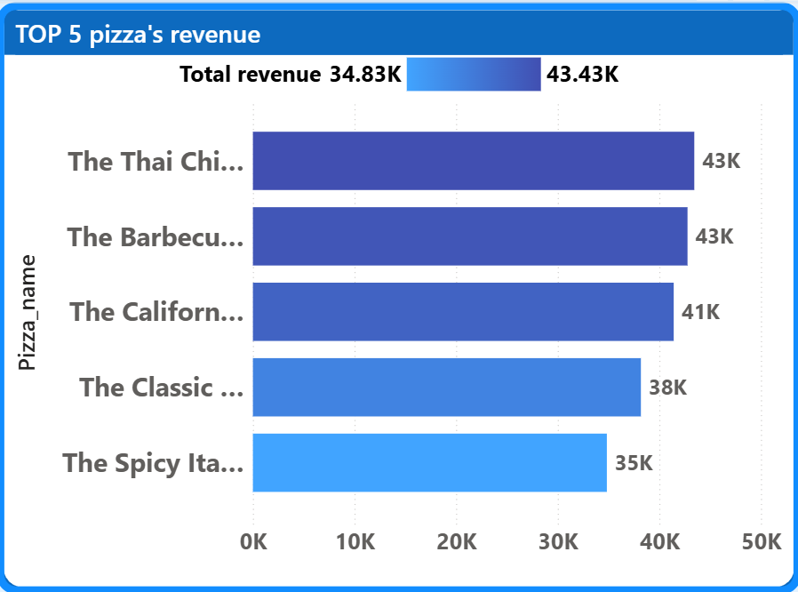
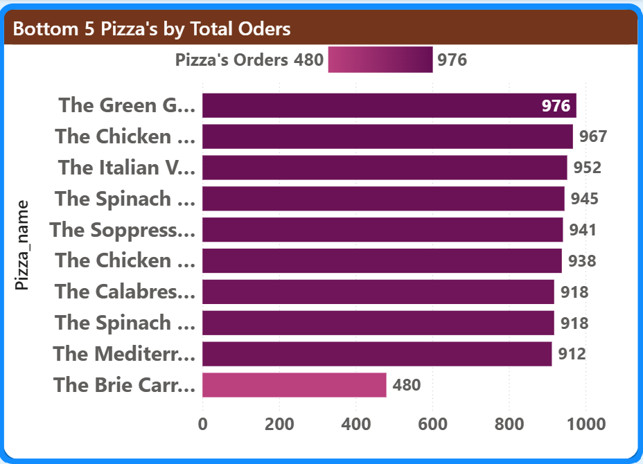
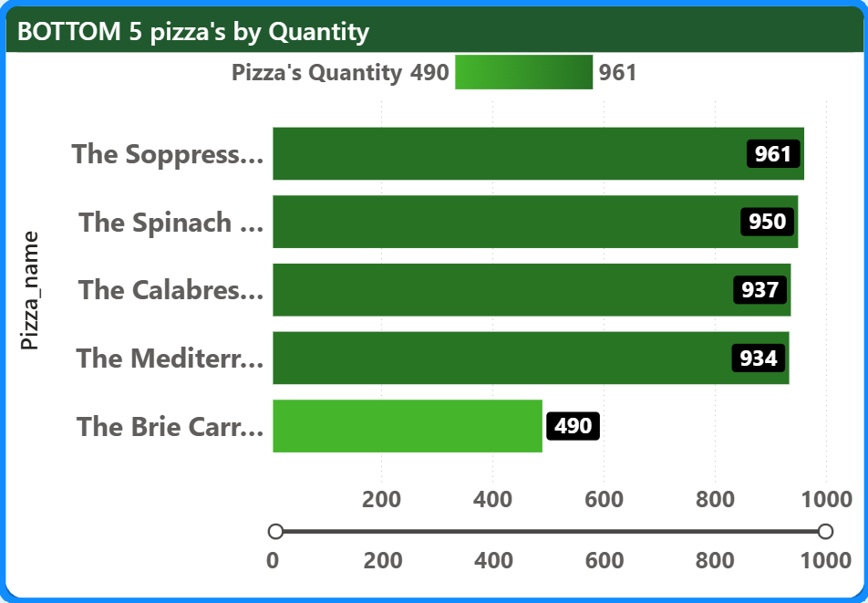
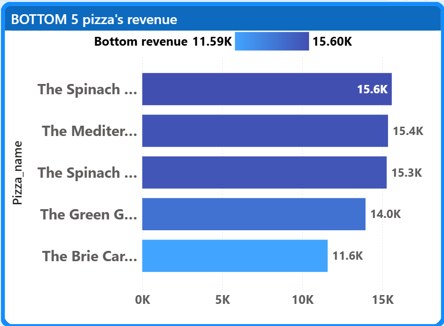

🍕 Pizza Sales Analysis
### Overview

In this project, I analyzed pizza sales data to understand overall business performance, customer ordering behavior, and product-level trends.
The goal of this analysis was to convert raw transactional data into clear business insights that can support decision-making related to sales, inventory, and operations.

I used SQL for data analysis and Power BI for dashboard-based visualization, following a real-world analytics workflow.

### Business Problem

A pizza restaurant wants to answer key business questions such as:
Which pizzas generate the most and least revenue?
When do customers place the highest number of orders?
How do pizza size and category affect sales performance?
Which products should be promoted or reconsidered?

### Objectives

Measure overall sales and revenue performance
Identify high-performing and low-performing pizzas
Analyze order trends across days and months
Understand customer purchasing behavior

📊 Insights & Storytelling (Dashboard Interpretation)

This section explains the key insights derived from the Power BI dashboard, along with the possible business reasons behind observed trends. The focus is on business interpretation, not just numbers.

1. Overall Business Performance (KPIs)

- **Total Revenue:** ~$817.86K  
- **Average Order Value (AOV):** ~$38.31  
- **Total Pizzas Sold:** ~49,574  
- **Total Orders:** ~21,350  
- **Average Pizzas per Order:** ~2.32  

### Insight
Customers typically order more than one pizza per order, indicating group or family-based purchasing behavior rather than individual orders.
Business Reason
Pizza is often consumed in groups, especially during weekends and evenings, which increases both order value and quantity per order.

2. Daily Order Trend (Weekday Analysis)
   

## Observation
Orders gradually increase from Sunday to Friday
Friday has the highest number of orders
Slight drop observed on Saturday

## Insight
Peak demand occurs on Friday and Saturday evenings
Weekdays show stable but lower demand compared to weekends

## Business Reason
End-of-week social gatherings, office parties, and family dinners drive higher sales
Saturday drop may be due to customers preferring dine-out or alternative food options

3. Monthly Order Trend (Seasonality)

## Observation
July shows the highest order volume
Strong performance also seen in January

-- ** Noticeable dip during September and October

## Insight
Sales show seasonal patterns
Certain months consistently outperform others

## Business Reason

July: Holiday season, summer breaks, and increased leisure time
January: New Year celebrations and promotional offers
September–October: Festival spending shifts towards home-cooked or traditional foods

4. Sales by Pizza Category

## Category Contribution

Classic category contributes the highest revenue and orders
Supreme and Chicken categories follow closely
Veggie category contributes the least

## Insight
Customers show a strong preference for classic and familiar flavors.
Business Reason
Classic pizzas appeal to a broader audience
They are safer choices for group orders
Veggie pizzas may cater to a smaller niche audience

5. Sales by Pizza Size

## Size Contribution
Large pizzas generate the highest share of sales
Medium size is the second most popular
Very low contribution from X-Large and XX-Large

## Insight
Customers prefer value-for-money sizes rather than extremely large options.
Business Reason
Large pizzas balance price and quantity
Extra-large pizzas may be perceived as expensive or unnecessary for most customers

6.Total Pizzas Sold by Category – Insights

## Key Observation

Classic category dominates (14,888 units).
Followed by Supreme (11,987), Veggie (11,649), and Chicken (11,050).
Demand drops steadily from Classic → Chicken.

## Reasons

Classic = Mass Appeal
Simple flavors, wide acceptance, family-friendly — leads to maximum volume.

Supreme Beats = Veggie & Chicken
Reason for Good Sales: Balanced mix of meat + veggies → wide customer appeal

Chicken Underperformance vs Expectation
Despite popularity, Chicken pizzas sell less than Classic due to higher price points and dietary restrictions.

Veggie Saturation
Veggie category performs well overall, but internal competition causes some veggie pizzas to fall into bottom 5.

7. Top 5 Pizzas by Total Orders

## Observation
Classic Deluxe Pizza receives the highest number of orders
Indicates strong repeat demand

## Insight
Some pizzas may not be premium-priced but are customer favorites.
Business Reason

## Familiar taste
Suitable across age groups
Reliable choice in mixed group orders

8. Top 5 Pizzas by Quantity Sold

## Observation
Classic Deluxe Pizza leads in quantity
Barbecue and Hawaiian pizzas follow closely

## Insight
High quantity sold does not always mean highest revenue, but it indicates frequent customer preference.

## Business Reason
These pizzas may be moderately priced
Suitable for repeated purchases and group sharing

9. Top 5 Pizzas by Revenue

## Key Performers
Thai Chicken Pizza
Barbecue Pizza
California Pizza
Classic Deluxe Pizza
Spicy Italian Pizza

## Insight
A small number of pizzas contribute a disproportionately large share of revenue.

## Business Reason
Popular flavors with consistent demand
Often selected in combo meals or repeat orders
Strong brand familiarity

10. Bottom 10 Pizzas by Total Orders – Insights

## Key Observation
Orders range from 480 to ~976, closely mirroring quantity trends.
The Brie Carre Pizza (480 orders) again ranks last.
Some pizzas have relatively high order counts but still appear here due to single-unit ordering behavior.

## Reasons
Single-Pizza Orders
These pizzas are often ordered alone, not in bulk, limiting volume impact.

Low Cross-Selling Potential
Customers rarely pair these pizzas with others.

Occasional Consumption
Considered “specialty” items rather than regular choices.

## Business Insight
Order frequency is insufficient to sustain high sales impact. These pizzas do not benefit from repeat or bulk ordering patterns.

11. Bottom 5 Pizzas by Quantity Sold – Insights

## Key Observation
Quantity sold ranges from ~490 to ~961 units.
The Brie Carre Pizza (490 units) is a clear outlier with very low demand.
Other pizzas cluster close together (~930–960 units), indicating uniformly weak demand.

## Reasons
Low Customer Awareness / Preference
Customers tend to choose familiar flavors; experimental or gourmet pizzas sell less.

Veggie Fatigue
Multiple veggie-heavy pizzas compete with each other, splitting demand rather than growing it.

Order Bundling Effect
These pizzas are rarely chosen as the “main” item in multi-pizza orders.

Business Insight
Quantity data confirms that low revenue is demand-driven, not pricing-driven. Marketing or combo offers would be required to improve movement.

12. Bottom 5 Pizzas by Revenue – Insights

## Key Observation
Bottom 5 pizzas generate revenue in a narrow band of ~11.6K to ~15.6K, which is significantly lower compared to top-selling pizzas.
The Brie Carre Pizza is the lowest revenue contributor (~11.6K).
Spinach- and Mediterranean-based pizzas appear multiple times, indicating consistent underperformance across variants.

## Reason
Lower Repeat Orders
Such pizzas are often tried once but not reordered frequently, impacting cumulative revenue.

Pricing vs Demand Mismatch
Even if prices are moderate, low demand volume keeps total revenue low.

Menu Positioning
These pizzas are likely overshadowed by popular categories such as Classic and Chicken, reducing visibility and selection.
